# Italianissimo - Booking Website
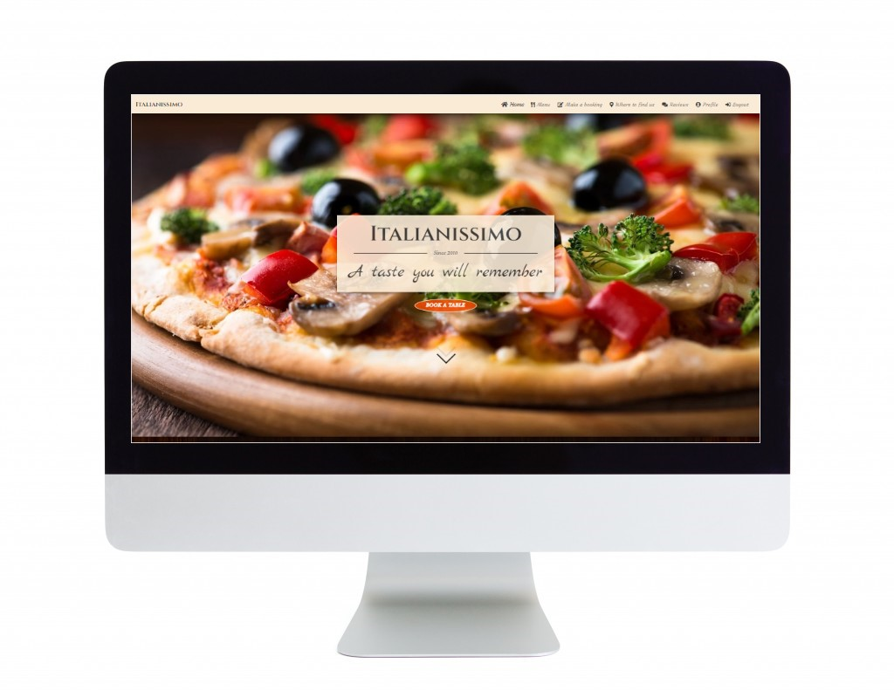 

## Overview
This is a project designed and developed to create a complete experience for the clients of Italianissimo Restaurant. The users are given the possibility to create a booking, post a review and mark their favourite meals, and the staff members dispose of an online system for managing all the bookings. All these functionalities can be accessed by any user with an account, considering that the staff members have special permissions for controlling the data.  
The website was created for real-life situations, but the restaurant name is fictive. 
**Italianissimo - booking website** was developed using Python (Django), HTML, CSS and JavaScript by storing the data in a PostgreSQL database.
  
The fully deployed project can be accessed at [this link](https://italianissimo-booking-website.herokuapp.com/).  

## UX

This site was created respecting the Five Planes Of Website Design: 
### Strategy

**User Stories:**  

|   EPIC                                |ID|                                User Story                                                   |
| :-------------------------------------|--|:------------------------------------------------------------------------------------------- |
|**CONTENT AND NAVIGATION**             |  ||
|                                       |1A| As a user, I want to see a menu so I can easily navigate through website content |             
|                                       |1B| As a user, I want to see relevant information about the restaurant|
|                                       |1C| As a user, I want the website to have a nice and intuitive design that will match the restaurant's theme|
|**USER REGISTRATION/AUTENTHICATION**   |  || 
|                                       |2A| As a user, I want to be able to register on the website|
|                                       |2B| As a user, I want to be able to authenticate using only email and password|
|                                       |2C| As a user, I want to be able to logout at any time|
|**BOOKING**                            |  ||
|                                       |3A| As a logged in user, I want to be able to find the available tables for a specific date and time|
|                                       |3B| As a logged in user, I want to be able to select the table that I want to reserve|
|**MENU**                               |  ||
|                                       |4A| As a user, I want to see the restaurant's menu with details about ingredients and price, so that I can be completely aware of everything I want to order|
|                                       |4B| As a logged in user, I want to be able to mark my favorite dishes on the menu|
|**USER PROFILE**                       |  ||
|                                       |5A| As a logged in user, I want to view a list of my upcoming bookings|
|                                       |5B| As a logged in user, I want to be able to  cancel my bookings|
|                                       |5C| As a logged in user, I want to see a list with my favorite dishes of the restaurant|
|**STAFF MANAGE BOOKINGS**              |  ||
|                                       |6A| As a logged in staff member, I want to see the restaurant's upcoming bookings for the current day sorted by time|
|                                       |6B| As a logged in staff member, I want to be able to filter bookings by date|
|                                       |6C| As a logged in staff member, I want to be able to cancel bookings|
|**REVIEWS**                            |  ||
|                                       |7A| As a user, I want to see the restaurant's customer reviews on the website|
|                                       |7B| As a logged in user, I want to be able to post and edit a review|
|**CONTACT**                            |  ||
|                                       |8A| As a user, I want to see the restaurant's opening and closing hours|
|                                       |8B| As a user, I want to see location information on the website|
|                                       |8C| As a user, I want to see contact information on the website|

**Project Goal:** 
Create a website for the Italianissimo restaurant that is usefull for clients and staff members as well.

**Project Objectives:**  
* To create a website with a simple and intuitive User Experience;
* To add content that is relevant and helps create a better image of the restaurant;
* To differentiate between client and staff member accounts;
* To implement fully functional features that will ease the staff members' tasks and upgrade clients' experience with the restaurant services;
* To make the website available and functional on every device.  

### Scope

**Simple and intuitive User Experience** 
* Ensure the navigation menu is visible and functional at every step;
* Ensure every page has a suggestive name that fits its content;
* Ensure the users will get visual feedback when navigating through pages;
* Create a design that matches the restaurant theme and does not confuse the users.

**Relevant content** 
* Add information about restaurant name, location and contact data;
* Make a clear and beautiful designed presentation of the menu elements;
* Create a section with the most ordered dishes;
* Create a section with customer reviews for full transparency.

**Features for upgraded experience** 
* Create a Booking feature that allows the users to see all the tables available for a specific date and time:
* Create a Menu feature that displays all the menu information and gives the possibility for the user to mark his favourite dishes;
* Create a Review feature that displays all the reviews added and gives the possibility for the user to add and edit his review;
* Create a Profile page for the user to see his upcoming bookings and favourite meals;
* Create a page for the staff member to manage all the bookings for all the users;

**Different client and staff member Accounts** 
* Permit the client to add/edit reviews and the staff member only the option to read them;
* Give the client permission to mark favourite meals and remove the option for staff members;
* Allow access to Profile page only for client type of users;
* Allow access to Manage Bookings page only for staff members type of users;

**Responsiveness** 
* Create a responsive design for desktop, tablet and mobile devices.  

### Structure

The structure of the website is divided into nine pages but with content depending on authentication and client/staff status  
-**Register/Login** pages give the user the possibility to create an account and authenticate for accessing different features. 
-**Logout** feature is a modal that helps user exit their current account; 
-The **Home** page is visible for both types of users and includes details about the restaurant, most appreciated dishes and top reviews; 
-The **Menu** page displays menu details and the "Add to favourite" option only for logged-in clients; 
-The **Booking** page is only available for logged-in users, both clients and staff members; 
-**Where to find us** contains information visible to all users; 
-The **Reviews** page displays all existent reviews and the "Add/Update review" option only for logged-in clients; 
-**Profile** page is only visible for the logged-in clients and displays "Upcoming bookings" and "Favourite dishes" sections; 
_**Manage Bookings** page gives access only to staff members and displays all the bookings registered, grouped and filtered by day. 

* FLOWCHARTS
The Flowchart for my program was created using <b>LucidChart</b> and it visually represents how the system works. 
[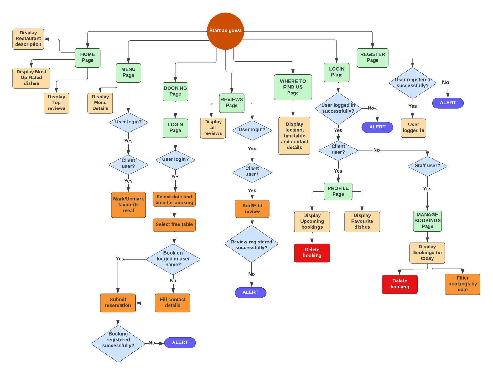](static/italianissimo/media/flowchart.png)  

### Skeleton

**Wireframes** 
The wireframes for mobile and desktop were created with [Balsamiq](https://balsamiq.com/) tool and can be viewed [here](static/italianissimo/wireframes/wireframes.pdf) 

**Database** 
The project uses the PostgreSQL relational database for storing the data. 
There were created two diagrams to represent the relation between the tables, the initial one and the final one.
The first one was created before the actual development of the website which led to some changes to the attributes and tables for finding the most relevant and useful ones to be kept.

  
Initial Schema

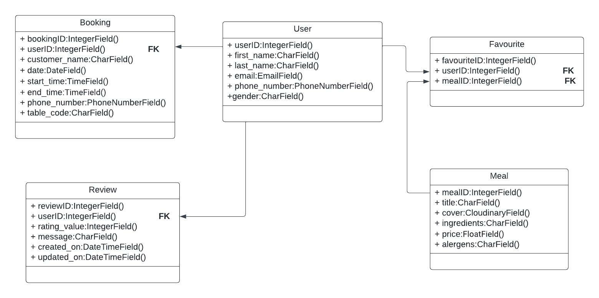 

  
Final Schema

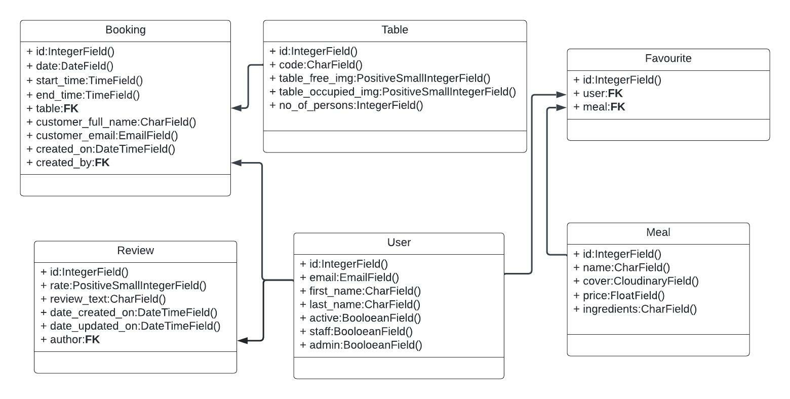 

  

### Surface

### SURFACE 
#### Color Scheme
All the colours were selected with the eyedropper plugin from the website cover, to maintain the chromatic harmony.  
* The primary colour scheme was used for most of the text existent on the website, in either dark or bright colours for creating a good contrast.  
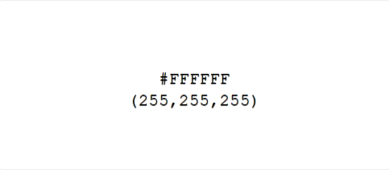
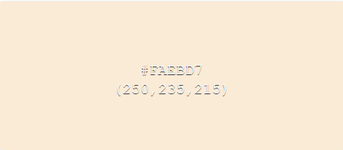
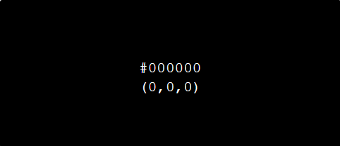
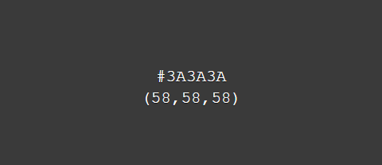 

* The seconday colour scheme was used for buttons, warnings, errors or for highlighting some important information. 
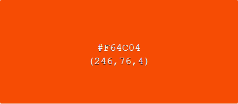
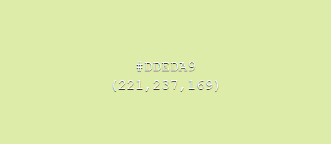
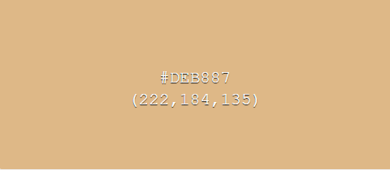
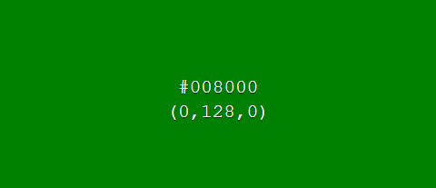

#### Fonts
* The fonts I used for this site were imported from [Google Fonts](https://fonts.google.com/): 
**Body:** Tiro Devanagari Marathi, serif 
**Navbar:** Courgette, cursive 
**Logo:** Cinzel, serif 
**Slogan:** Marck Script, cursive 

#### Visual Effects
* Box shadows
Multiple box shadows were used for cover, buttons and images. They were inspired from [css-box-shadow-examples]("https://getcssscan.com/css-box-shadow-examples") 
* Animation
Some animations were used for creating a dinamic and atractive design

  
View Moving arrows animation

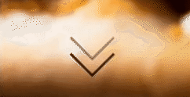 

  
View Authentication links Pulse animation

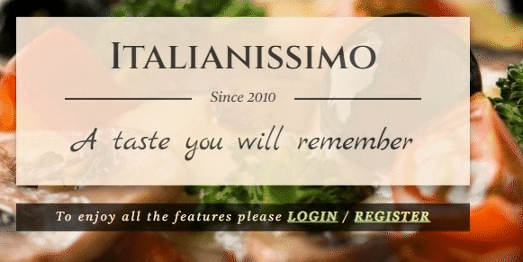 

* Hover effects

  
NavBar elements hover

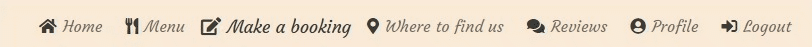 

  
Buttons hover

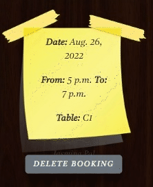 

Footer elements hover

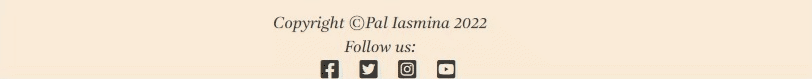 

### Agile Methodology

## Features

### Existing Features

### Future Feature Considerations

## Technologies Used

## Testing

## Deployment

## Credits

### Content

### Media

### Code

## Acknowledgements

