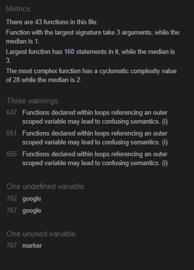
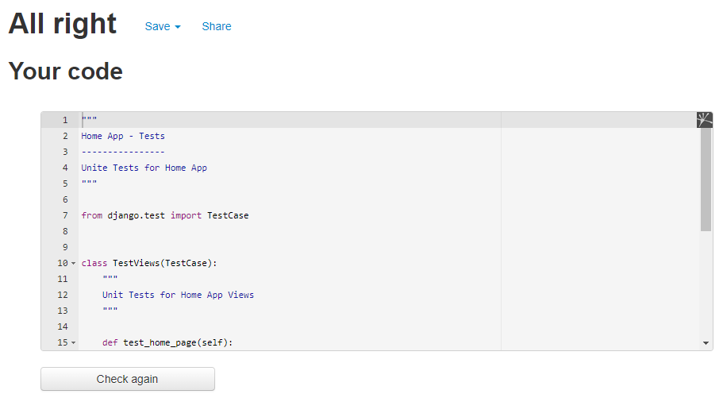
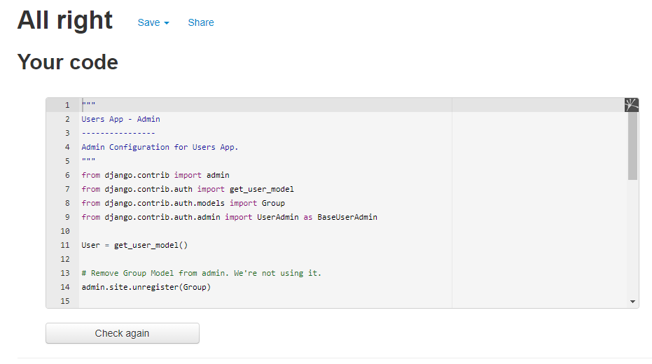
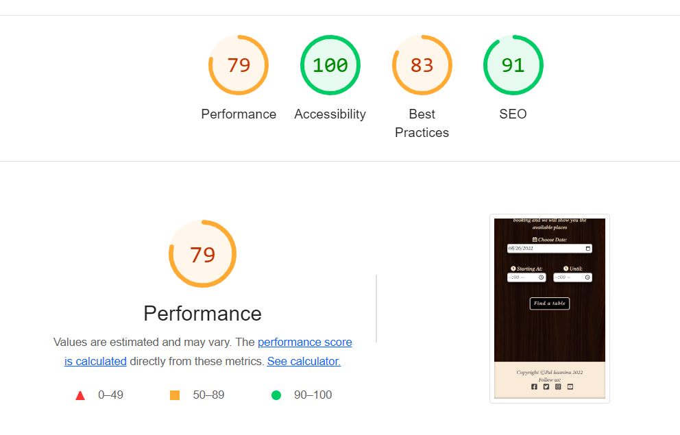

# Testing

Back to [README.MD](README.MD) 

## Table of contents
* [User Story and Feature Testing](#user-story-and-feature-testing)
* [Automated View Testing](#automated-view-testing)
* [Browser Testing](#browser-testing)
* [Code Validation](#code-validation)

## User Story and Feature Testing
All the user stories were tested manually, that including all the representative features, and were described bellow with a summary of the steps made for demonstrating the validation of the tests:  

### CONTENT AND NAVIGATION

#### 1A: As a user, I want to see a menu so I can easily navigate through website content  
* **Acceptance Criteria:** A site user should always have access to the navigation menu so he can easily switch between pages at any time.
* **Summary:** 
    -When a user visits the website he can easily see the navigation menu at the top of the page; 
    -Even if switching the pages, the menu is always present at the top and indicates what page is active at the moment; 
    -For the *Home* page, a *Bottom to top* button is present at the end of the content, considering that its size can vary, and redirects the user to the page start where he can access the navigation links; 
    -For logged-in clients, the menu contains an additional page, *Profile*, and *Logout* link replaces *Register* and *Login* pages; 
    -For logged-in staff members, the navigation includes *Manage Bookings* page, instead of *Profile*.  

    *By testing all these features, it can be affirmed that the user story is accomplished.* 
* **Outcome:** Pass
#### 1B: As a user, I want to see relevant information about the restaurant
* **Acceptance Criteria:** A site user should be able to see relevant information that will help him create an idea about the restaurant's services.
* **Summary:**   
    -When a user first visits the website, he is redirected to the *Home* page and a big cover with a pizza background is displayed, suggesting what is the speciality of the restaurant; 
    -The cover also displays information about the name, year of opening and slogan of the restaurant; 
    -"About us" is a section on the *Home* page that describes the restaurant's mission and contains two images of the place; 
    -Another two sections exist on the *Home* page that help the user to make an idea about the quality of the services: *Most Appreciated Dishes* and *Top Reviews*; 
    -More information about the restaurant specialities and contact details can be found on the *Menu* and *Where to find us* pages.  

    *By testing all these features, it can be affirmed that the user story is accomplished.* 
* **Outcome:** Pass
#### 1C: As a user, I want the website to have a nice and intuitive design that will match the restaurant's theme
* **Acceptance Criteria:**  A site user should be able to access the content through an attractive design that would make him want to return to it anytime.
* **Summary:** 
    -When a user first visits the website he is redirected to *Home page* where the first impression is created when noticing the well-chosen fonts chosen for the navbar, title and slogan, as well as the cover image which suggests the restaurant's speciality; 
    -The colours of the website were tested to match the contrast requirements and all the colours chosen are derivated from the colours' palette of the background cover; 
    -On the website there are elements created to help the user have a better experience when navigating through the content, such as hyperlinks, arrows redirecting to the next section of the page or a button to bring the user back to the top; 
    -On the Home, Menu and Reviews page, there are messages that suggest to the user to Register or Login to enjoy all the features of the website; 
    -The user gets feedback as alerts every time he performs an action such as Registering, Signing In/Signing Out, adding a booking, posting/updating a review.  

    *By testing all these features, it can be affirmed that the user story is accomplished.* 
* **Outcome:** Pass   
### USER REGISTRATION/AUTENTHICATION

#### 2A: As a user, I want to be able to register on the website
* **Acceptance Criteria:** A site user should be able to create an account by filling in a form on the website.   
* **Summary:** 
    -There is a Register page that provides a form with email, first name, last name and password for the user to fill in; 
    -When the user submits the form a new entry is created in the Users table; 
    -A success alert is displayed with the message "Logged in as..." that confirms to the user that he has been registered successfully.  

    *By testing all these features, it can be affirmed that the user story is accomplished.*  
* **Outcome:** Pass 
#### 2B: As a user, I want to be able to authenticate using only email and password
* **Acceptance Criteria:** A site user should be able to authenticate at any time with email and password.
* **Summary:** 
    -There is a Login page that provides a form with email and password to be filled; 
    -The authentication form has a "Remember me" checkbox that will keep the user logged in; 
    -A success alert is displayed with the message "Logged in as..." that confirms to the user that he has been logged in successfully.  

    *By testing all these features, it can be affirmed that the user story is accomplished.*  
* **Outcome:** Pass
#### 2C: As a user, I want to be able to logout at any time
* **Acceptance Criteria:** A site user should be able to exit current account at any time.
* **Summary:**    
    -There is a Logout modal that can be triggered when clicking on the hyperlink in the navbar. The modal is implemented as part of defensive programming; 
    -The logout modal asks the user again if he wishes to exit the current account; 
    -A success alert is displayed with the message "Logged out" that confirms to the user that he has been successfully logged out.  
    
    *By testing all these features, it can be affirmed that the user story is accomplished.*  
* **Outcome:** Pass
### BOOKING

#### 3A: As a logged in user, I want to be able to find the available tables for a specific date and time
* **Acceptance Criteria:** A logged user should be provided a booking system that generates the tables availability.  
* **Summary:**  
    -There is a booking page that can be accessed only by authenticated users, considering that all the booking entries must have the current user as the author; 
    -The booking sections appear successive only after the previous ones are validated; 
    -The first section contains inputs for Date, Start and End time, for the user to fill in; 
    -The validation of these values is very strict to prevent errors when generating the tables section. The following rules are being checked:
    * The Date value should not be less than the current day; 
    * For the current day the Start hour can't be less than the current hour; 
    * End Hour should be greater than Start hour; 
    * Start and End hours must be between 9:00 AM - 11:00;  

    -When the user clicks the *Find a table* button, if the validation is complete, the next section appears with all the tables in the restaurant; 
    -There is a legend with the colours for "Free" and "Busy" status of the tables; 
    -If a table is reserved for the date filled in by the user, and the reservation time intersects with the hours in the form, the table appears in grey, as *Busy*, otherwise in bright yellow, as *Free*.  

    *By testing all these features, it can be affirmed that the user story is accomplished.*  
* **Outcome:** Pass
#### 3B: As a logged in user, I want to be able to select the table that I want to reserve and complete my booking
* **Acceptance Criteria:** A logged in user should be be able to complete his booking by choosing one of the free tables available.
* **Summary:** 
    -When the tables' section is displayed, it also contains a dropdown with the tables' codes;  
    -The dropdown values correspond with the status of the tables and only the ones with the status *Free* are included in the list, for preventing errors when submitting the booking;  
    -A read-only input is placed near the dropdown, of which value represents the number of seats on the table, as information for the user;  
    -When the user chooses another value from the tables dropdown list, the value of the input changes accordingly;  
    -After selecting a table there is only one more step for completing the reservation, the contact details, which can be filled in or registered automatically when choosing *Book it on my name*;  
    -If the overview of the booking corresponds with the user's selections, the form can be submitted;  
    -An alert appears to inform the user that the reservation was successful.    

    *By testing all these features, it can be affirmed that the user story is accomplished.*  
* **Outcome:** Pass
### MENU

#### 4A: As a user, I want to see the restaurant's menu with details about ingredients and price, so that I can be completely aware of everything I want to order
* **Acceptance Criteria:** A user should be provided with a list of the menu content, as essential information for a restaurant client.
* **Summary:** 
    -There is a *Menu* page that can be accessed by any type of user; 
    -A list of meals is displayed and it is visible to any type of user; 
    -Every menu item is provided with an image of the meal, name, ingredients and price; 
    -All images have the same dimensions, with transparent backgrounds, and prices are highlighted, for better visual impact.  
    
    *By testing all these features, it can be affirmed that the user story is accomplished.*  
* **Outcome:** Pass
#### 4B: As a logged in user, I want to be able to mark/unmark my favorite dishes on the menu
* **Acceptance Criteria:** A logged-in user should be provided with a way of marking/unmarking his favourite dishes only when he's authenticated. 
* **Summary:**  
    -In the menu page, there is a feature visible only to users that are authenticated and not staff members, considering that this feature wouldn't make sense for admins; 
    -For unauthenticated users, an informative message is displayed for users to log in to be able to mark their favourite meals;   
    -To mark a dish as *favourite*, a form is displayed with an empty heart icon that acts like a button, and a suggestive message, "Add to favourites", that indicates to the user what is its purpose; 
    -When the user clicks on the button, the change is visible immediately, as the heart icon changes its shape into a filled heart, and the message is now "Remove from favourites"; 
    -By clicking on the filled heart, the form comes back to its initial state, and the meal is removed from favourites; 
    -It has been tested the removing of the *favourite* entry using the URL and no action is performed. Also when it was tested for another user, the custom 403(forbidden) page appears; 
    -The state of the meals is visually represented and constant even if the user reloads the page, that meaning that the database has successfully updated the list that contains the favourite dishes for the current user; 
    -The list of *Favourite* meals also influences the elements displayed in the section *Most appreciated dishes* found on the *Home* page. The dishes change their order depending on the number of users that marked them as *favourite*.  

    *By testing all these features, it can be affirmed that the user story is accomplished.*  
* **Outcome:** Pass 
### USER PROFILE

#### 5A: As a logged in user, I want to view a list of my upcoming bookings
* **Acceptance Criteria:** A logged in user should be able to see all the upcoming reservations made on his account. 
* **Summary:** 
    -There is a *Profile* page that is visible only to authenticated users and is prohibited to staff members; 
    -On the *Profile* page there is a section called *Upcoming bookings*; 
    -Whenever a user makes a successful reservation on the *Booking* page, the element is immediately added and visible on the *Profile* page;  
    -The section contains all bookings except the ones reserved before the current day, as the older bookings are not considered relevant anymore to be displayed in profile; 
    -Every booking is represented as a note with the essential details on it  such as Date, Start/End time, Table code and Customer name, and the list is paginated to display only 2 elements at a time for a better visual impact; 
    -As this section contains the list of the bookings made from this account, it includes all the reservations that are created by the current user, whether the customer name was registered as the current name or another name.  
    
    *By testing all these features, it can be affirmed that the user story is accomplished.*  
* **Outcome:** Pass
#### 5B: As a logged in user, I want to be able to cancel my bookings
* **Acceptance Criteria:** A logged in user should be provided a way to delete a booking if he no longer wishes to keep it. 
* **Summary:** 
    -Every element in the *Upcoming Bookings* section has a "Delete booking" button; 
    -When the user clicks on the button a modal is triggered for confirmation; 
    -Each modal asks for confirmation by displaying the Date, Start and End time of the reservation in order to prevent an unwanted removal; 
    -After confirmation, the output is immediately visible as the element is removed from the list, and if the list becomes empty a suggestive message is displayed; 
    -It has been tested the removal of the *booking* entry using the URL and no action is performed. Also when it was tested for another user, the custom 403(forbidden) page appears.  

    *By testing all these features, it can be affirmed that the user story is accomplished.*  
* **Outcome:** Pass
#### 5C: As a logged in user, I want to see a list with my favorite dishes of the restaurant
* **Acceptance Criteria:** A logged in user should be able to see all the meals added to *Favourite* list displayed in *Profile* page.  
* **Summary:** 
    -In *Profile* page there is a section called *Your favourite dishes*; 
    -The section displays every meal from the menu added to *Favourite* list; 
    -Every element is represented with the meal image and name using a simple and atractive design; 
    -When adding a meal to *Favourites* list from the *Menu* page, the change is immediately reflected in the *Profile* page as well.  

    *By testing all these features, it can be affirmed that the user story is accomplished.*  
* **Outcome:** Pass
### STAFF MANAGE BOOKINGS

#### 6A: As a logged in staff member, I want to see the restaurant's upcoming bookings for the current day sorted by time
* **Acceptance Criteria:** A logged in staff member should be able to see bookings from all the users ordered by time and grouped by date.   
* **Summary:** 
    -There is a *Manage Bookings* page visible only for logged-in staff members and prohibited for users that are not staff; 
    -The page displays all the bookings for the current day sorted by time, which is very helpful for a staff member that wants to take a look over today's reservations; 
    -The bookings are listed in a table and every column represents an important detail such as Date, Time interval, Table code, Customer name and email; 
    -There is an informative text that specifies the date and number of the bookings.  

    *By testing all these features, it can be affirmed that the user story is accomplished.*  
* **Outcome:** Pass
#### 6B: As a logged in staff member, I want to be able to filter bookings by date
* **Acceptance Criteria:** A logged-in staff member should be provided with a way of sorting bookings by date for a clearer way of visualising the reservations.
* **Summary:** 
    -Considering that the page displays by default only the bookings for the current day, there is a form that is used for filtering the data by date; 
    -On submitting the form the reservations for the selected date appear with the informative text displaying the date and number of bookings; 
    -The filter for the bookings can be applied any number of times the user wishes and also for reservations made before the current day.  
    
    *By testing all these features, it can be affirmed that the user story is accomplished.*  
* **Outcome:** Pass
#### 6C: As a logged in staff member, I want to be able to cancel bookings
* **Acceptance Criteria:** A logged-in staff member should be able to delete any reservation from the database.
* **Summary:** 
    -Every row from the table represents a booking and the last column contains a "Delete booking" button; 
    -When a staff member clicks on the button a modal is triggered for confirmation; 
    -The modal asking for confirmation also displays the corresponding booking id for preventing an unwanted deletion; 
    -When a reservation is removed the corresponding row is immediately deleted from the table and if the list becomes empty, a suggestive message is displayed; 
    -When a reservation is removed, the page loads with the last date filter included, if existed one before the deletion. That creates a better user experience when managing the bookings; 
    -It has been tested the removal of a *booking* entry using the URL and no action is performed. Also when it was tested from a not-staff account, the custom 403(forbidden) page appears.  

    *By testing all these features, it can be affirmed that the user story is accomplished.*  
* **Outcome:** Pass
### REVIEWS

#### 7A: As a user, I want to see the restaurant's customer reviews on the website
* **Acceptance Criteria:**  A user should have access to a way of seeing all the reviews added on the website for creating a better idea about the offered services.
* **Summary:** 
    -There is a page called "Reviews" that is accessible to all types of users; 
    -On the page there is a list of reviews paginated to display only 4 elements at a time for a better user experience; 
    -Every review element has an attractive design and contains relevant details such as User name, Review text, Star rating and Date and Time of posting; 
    -The reviews are ordered by time in a reverse way so that the last added review is the first on the list.  

    *By testing all these features, it can be affirmed that the user story is accomplished.*  
* **Outcome:** Pass
#### 7B: As a logged in user, I want to be able to post and edit a review
* **Acceptance Criteria:** A logged in user should be provided a way of adding and editing a review for the restaurant.
* **Summary:** 
    -On the *Review* page there is an "Add/Edit review" section only visible for authenticated users that are not staff members, as this action wouldn't make sense for admins to make; 
    -For a user that hasn't already added a review to the list, there is a form to fill in for creating one; 
    -The form only contains an input  for the review message to be posted, and a star rating functionality was implemented with a default value of 1 star; 
    -There is no implementation for approval of the review because a restaurant has to have real and transparent opinions; 
    -When the review is posted, an alert is triggered confirming that the review was successfully added to the list; 
    -The response is immediate and the review appears as the first on the list; 
    -If the current user already added his review, it is displayed in the section "Your review"; 
    -For editing the review, a form is displayed when the user clicks on the *Update* button; 
    -The form already contains the text of the review to be edited, and the Star rating feature has by default the initial value; 
    -When the user submits the edited review, an alert is triggered to confirm that the update was successful; 
    -The date and time are updated with the current ones and the review becomes first on the list; 
    -"Your review" section updates its values as well; 
    -It has been tested the updating of the current *review* entry using the URL and no action is performed. Also when it was tested for another user's review, the custom 403(forbidden) page appears; 
    -When a user posts a review, it also influences the displaying of the elements in the "From our clients " section on the *Home* page, where there are selected top three reviews with the best rating.   

    *By testing all these features, it can be affirmed that the user story is accomplished.*  
* **Outcome:** Pass
### CONTACT

#### 8A: As a user, I want to see the restaurant's opening and closing hours
* **Acceptance Criteria:** A site user should be provided information about opening and closing hours for every day.
* **Summary:**   
    -There is a page called "Where to find us" visible to any type of user; 
    -The page displays a container with the timetable for every day of the week; 
    -The timetable has a simple and attractive design and the information is clear.  

     *By testing all these features, it can be affirmed that the user story is accomplished.*  
* **Outcome:** Pass
#### 8B: As a user, I want to see location information on the website
* **Acceptance Criteria:** A site user should be provided information about restaurant's location.
* **Summary:** 
    -On the "Where to find us" page there is a google map with a marker pointed to the restaurant's location; 
    -Also there is an informative text with the address of the restaurant;  

    *By testing all these features, it can be affirmed that the user story is accomplished.*  
* **Outcome:** Pass
#### 8C: As a user, I want to see contact information on the website
* **Acceptance Criteria:** A site user should be provided the restaurant's contact information.
* **Summary:**  
    -On the "Where to find us" page there is a section with contact information; 
    -The section displays the phone number and contact email for the restaurant.  

    *By testing all these features, it can be affirmed that the user story is accomplished.*  
* **Outcome:** Pass

### Aditional Manual Testing
#### Error Handling

* Ensure that **403 HTTP** errors display custom 403.html.
    - **Stress Test:** Input a route in the URL for accessing another user content
* Ensure that **404 HTTP** errors display the custom 404.html.
    - **Stress Test:** Input a random route in the URL that can't be found in the declared paths of the project
* Ensure that **500 HTTP** errors display the custom 500.html.
    - **Stress Test:** Set debug to false and try to access a path that has been breaked intentionally.

#### Interface Interaction

* Ensure all interactive elements respond appropriately:
    - **Desktop:**
        - All navbar elements correctly respond to hovering.
        - All buttons correctly respond to hovering.
        - All authentication links correctly respond to hovering
    - **Mobile:**
        - All navbar elements correctly respond to touch.
        - All buttons correctly respond to touch.
        - All authentication links correctly respond to touch

#### Links

* Ensure the external links to social media present in the footer open up in new tabs.

---

## Automated View Testing
### Test Overview

* **Home App** 
Tests applied for user stories: **1B** 
  

* **Booking App** 
Tests applied for user stories: **3A, 3B, 5A, 5B, 6A, 6B, 6C** 
  

* **Contact App** 
Tests applied for user stories: **8A, 8B, 8C** 
  

* **Menu App** 
Tests applied for user stories: **4A, 4B, 5C** 
  

* **Review App** 
Tests applied for user stories: **7A, 7B** 
  

### Test Coverage

For generating a report with the coverage of the automated tests, [coverage](https://coverage.readthedocs.io/en/coverage-5.5/) module was used. 
The full report can be found [here]("static/reports/test_coverage.xlsx").

## Browser Testing
The website was tested on different browser for assuring the features work accordingly.
* Chrome
* Edge
* Safary
* Opera
* Firefox

## Code Validation
### HTML

The html code of the website was validated using [W3 Markup Validator](https://validator.w3.org/). 
At the time of deployment the validation have the following outcome:  

  

The following pages have been tested:
* Home
* Menu
* Make a booking
* Where to find us
* Reviews
* Profile
* Manage bookings
* Login/Register
* 403/404/500 custom pages

### CSS

The CSS code was validated using [W3 Jigsaw Validator](https://jigsaw.w3.org/css-validator/) 
At the time of deployment the validation for *style.css* has the following outcome:  

  

### Javascript

The Javascript code was validated using using [JsHint](https://jshint.com/) 
At the time of deployment the validation for *script.js* has the following outcome:  

  

* The warnings appeared because of EventListeners added to elements in a loop. 
I tried to solve the issue but no successful method has been found, so I chose to ignore the warning as it is not affecting the way my code works in any way.
* The script for defining the google map present in the *Where to find us page* contains *google* and *map* variables that generate the errors in the linter. As this is a script taken from the [Google Developers Website](https://developers.google.com/maps/documentation/javascript/adding-a-google-map), I choose to ignore this issue as well as there is no fix found for it. 

### Python
The python code was tested using [PEP8](http://pep8online.com/) online validator. 

**Pep8 results:** 

Home app

* **apps.py** 
  

* **tests.py** 
  

* **urls.py** 
  

* **views.py** 
  

Menu app

* **admin.py** 
  

* **apps.py** 
  

* **forms.py** 
  

* **models.py** 
  

* **tests.py** 
  

* **urls.py** 
  

* **views.py** 
  

Booking app

* **admin.py** 
  

* **apps.py** 
  

* **filters.py** 
  

* **forms.py** 
  

* **models.py** 
  

* **tests.py** 
  

* **urls.py** 
  

* **views.py** 
  

Contact app

* **apps.py** 
  

* **tests.py** 
  

* **urls.py** 
  

* **views.py** 
  

Review app

* **admin.py** 
  

* **apps.py** 
  

* **forms.py** 
  

* **models.py** 
  

* **tests.py** 
  

* **urls.py** 
  

* **views.py** 
  

Users app

* **admin.py** 
  

* **apps.py** 
  

* **models.py** 
  

 

* Although there is no code line greater than 100, there are a few errors of type "Line too long" that I decided to ignore because it would mean breaking the code in a way that would make it difficult to read. 

### Accesibility 
The accesibility of the website was tested with [Wave](https://wave.webaim.org/)

**Wave results:** 

Home page

  

Menu page

  

Where to find us page

* The error on this page is caused by the "Image map area missing alternative text". 
As the google map is built of multiple images without an alt attribute, I didn't find a proper way to add the attribute to all of them, as I also consider the error message to be confusing about which image it is targeted. 
  

Reviews page

  

Profile page

  

Manage bookings page

  

Login page

  

Register page

  

 

### Performance
The performance of the website was tested with [Google Lighthouse](https://developer.chrome.com/docs/lighthouse/overview/)

**Lighthouse reports:** 

Desktop

* Home page 
  

* Menu page 
  

* Booking page 
  

* Where to find us page 
  

* Reviews page 
  

* Profile page 
  

* Manage bookings page 
  

* Login page 
  

* Register page 
  

Mobile
  

* Home page 
  

* Menu page 
  

* Booking page 
  

* Where to find us page 
  

* Reviews page 
  

* Profile page 
  

* Manage bookings page 
  

* Login page 
  

* Register page 
  

 

Back to [README.MD](README.MD) 
 

