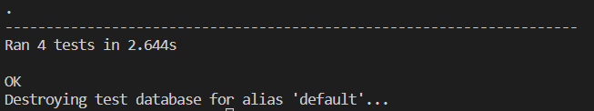

# Testing

## Table of contents
* [User Story and Feature Testing](#user-story-and-feature-testing)
* [Automated View Testing](#automated-view-testing)
* [Browser Testing](#browser-testing)
* [Code Validation](#code-validation)

## User Story and Feature Testing
All the user stories were tested manually, that including all the representative features, and were described bellow with a summary of the steps made for demonstrating the validation of the tests:  

### CONTENT AND NAVIGATION

#### 1A: As a user, I want to see a menu so I can easily navigate through website content  
* **Acceptance Criteria:** A site user should always have access to the navigation menu so he can easily switch between pages at any time.
* **Summary:**  
    -When a user visits the website he can easily see the navigation menu at the top of the page; 
    -Even if switching the pages, the menu is always present at the top and indicates what page is active at the moment; 
    -For the *Home* page, a *Bottom to top* button is present at the end of the content, considering that its size can vary, and redirects the user to the page start where he can access the navigation links; 
    -For logged-in clients, the menu contains an additional page, *Profile*, and *Logout* link replaces *Register* and *Login* pages; 
    -For logged-in staff members, the navigation includes *Manage Bookings* page, instead of *Profile*.  
    *By testing all these features, it can be affirmed that the user story is accomplished.* 
* **Outcome:** Pass
#### 1B: As a user, I want to see relevant information about the restaurant
* **Acceptance Criteria:** A site user should be able to see relevant information that will help him create an idea about the restaurant's services 
* **Summary:**    
    -When a user first visits the website, he is redirected to the *Home* page and a big cover with a pizza background is displayed, suggesting what is the speciality of the restaurant; 
    -The cover also displays information about the name, year of opening and slogan of the restaurant; 
    -"About us" is a section on the *Home* page that describes the restaurant's mission and contains two images of the place; 
    -Another two sections exist on the *Home* page that help the user to make an idea about the quality of the services: *Most Appreciated Dishes* and *Top Reviews*; 
    -More information about the restaurant specialities and contact details can be found on the *Menu* and *Where to find us* pages;  
    *By testing all these features, it can be affirmed that the user story is accomplished.* 

* **Outcome:** Pass
#### 1C: As a user, I want the website to have a nice and intuitive design that will match the restaurant's theme
* **Acceptance Criteria:**  
* **Summary:** 
* **Outcome:** Pass   
### USER REGISTRATION/AUTENTHICATION

#### 2A: As a user, I want to be able to register on the website
* **Acceptance Criteria:**  
* **Summary:**   
* **Outcome:** Pass 
#### 2B: As a user, I want to be able to authenticate using only email and password
* **Acceptance Criteria:**  
* **Summary:**    
* **Outcome:** Pass
#### 2C: As a user, I want to be able to logout at any time
* **Acceptance Criteria:**  
* **Summary:**    
* **Outcome:** Pass
### BOOKING

#### 3A: As a logged in user, I want to be able to find the available tables for a specific date and time
* **Acceptance Criteria:**  
* **Summary:**    
* **Outcome:** Pass
#### 3B: As a logged in user, I want to be able to select the table that I want to reserve
* **Acceptance Criteria:**  
* **Summary:**  
* **Outcome:** Pass
### MENU

#### 4A: As a user, I want to see the restaurant's menu with details about ingredients and price, so that I can be completely aware of everything I want to order
* **Acceptance Criteria:**  
* **Summary:**    
* **Outcome:** Pass
#### 4B: As a logged in user, I want to be able to mark my favorite dishes on the menu
* **Acceptance Criteria:**  
* **Summary:**     
* **Outcome:** Pass 
### USER PROFILE

#### 5A: As a logged in user, I want to view a list of my upcoming bookings
* **Acceptance Criteria:**  
* **Summary:**    
* **Outcome:** Pass
#### 5B: As a logged in user, I want to be able to cancel my bookings
* **Acceptance Criteria:**  
* **Summary:**    
* **Outcome:** Pass
#### 5C: As a logged in user, I want to see a list with my favorite dishes of the restaurant
* **Acceptance Criteria:**  
* **Summary:**    
* **Outcome:** Pass
### STAFF MANAGE BOOKINGS

#### 6A: As a logged in staff member, I want to see the restaurant's upcoming bookings for the current day sorted by time
* **Acceptance Criteria:**  
* **Summary:**    
* **Outcome:** Pass
#### 6B: As a logged in staff member, I want to be able to filter bookings by date
* **Acceptance Criteria:**  
* **Summary:**    
* **Outcome:** Pass
#### 6C: As a logged in staff member, I want to be able to cancel bookings
* **Acceptance Criteria:**  
* **Summary:**    
* **Outcome:** Pass
### REVIEWS

#### 7A: As a user, I want to see the restaurant's customer reviews on the website
* **Acceptance Criteria:**  
* **Summary:**    
* **Outcome:** Pass
#### 7B: As a logged in user, I want to be able to post and edit a review
* **Acceptance Criteria:**  
* **Summary:**    
* **Outcome:** Pass
### CONTACT

#### 8A: As a user, I want to see the restaurant's opening and closing hours
* **Acceptance Criteria:**  
* **Summary:**    
* **Outcome:** Pass
#### 8B: As a user, I want to see location information on the website
* **Acceptance Criteria:**  
* **Summary:**    
* **Outcome:** Pass
#### 8C: As a user, I want to see contact information on the website
* **Acceptance Criteria:**  
* **Summary:**    
* **Outcome:** Pass

## Automated View Testing
### Test Overview

* **Home App** 
Tests applied for user stories: **1B** 
  

* **Booking App** 
Tests applied for user stories: **3A, 3B, 5A, 5B, 6A, 6B, 6C** 
  

* **Contact App** 
Tests applied for user stories: **8A, 8B, 8C** 
  

* **Menu App** 
Tests applied for user stories: **4A, 4B, 5C** 
  

* **Review App** 
Tests applied for user stories: **7A, 7B** 
  

### Test Coverage

## Browser Testing
## Code Validation

 

